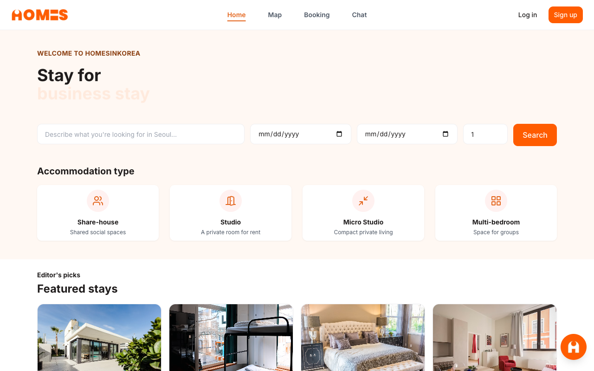
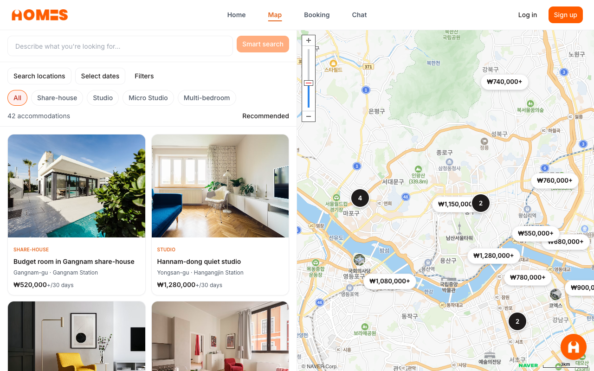
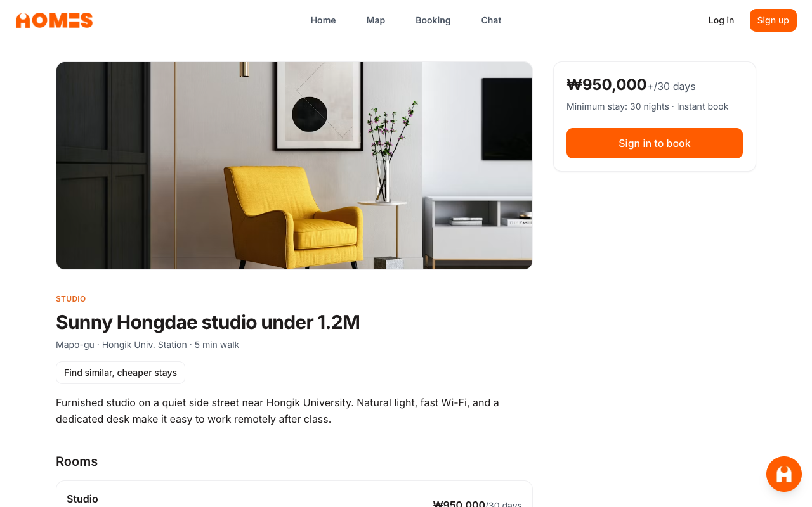

<!--  -->

## Overview

**Housing Platform** is a full-stack furnished housing marketplace demo. Users can search and book monthly stays (share-houses, studios, and multi-bedroom units), while hosts manage listings and admins oversee the platform.

Built as a pnpm monorepo with a React SPA (`apps/web`), a shared design system (`packages/ui`), and Supabase for auth, database, storage, and Edge Functions.

## Getting Started

**Prerequisites:** Node.js 20+, pnpm 9+, and the [Supabase CLI](https://supabase.com/docs/guides/cli) for local backend.

1. Install dependencies:

   ```bash
   pnpm install
   ```

2. Copy environment variables:

   ```bash
   cp .env.example apps/web/.env.local
   ```

3. Start the dev server:

   ```bash
   pnpm dev
   ```

4. Open [http://127.0.0.1:5173](http://127.0.0.1:5173) in your browser.

For auth, search, and bookings locally, start Supabase and seed the database:

```bash
supabase start
pnpm db:reset
```

Copy the **anon key** from the CLI output into `apps/web/.env.local`. Dev accounts (password: `1234qwer`): `host@gmail.com`, `admin@gmail.com`, `luizfernandovieiraferreira@gmail.com`.

## Stack

| Layer    | Technologies                                                             |
| -------- | ------------------------------------------------------------------------ |
| Frontend | React, TypeScript, Vite, Tailwind CSS, React Router, TanStack Query, Zod |
| UI       | Custom design system in `packages/ui` with Storybook                     |
| Backend  | Supabase (PostgreSQL, Auth, RLS, Storage, Edge Functions)                |
| Tooling  | pnpm workspaces, Turbo, ESLint, Prettier, Vitest, Testing Library        |

<!-- <div style="display: flex; gap: 8px;">
  
  
  
</div> -->
